<!-- # -*- coding: utf-8 -*- -->
# RSciTE
# Guida alle Caratteristiche

**Autore : Roberto Rossi**

**Versione 102**

Un gestore di testi **potente**, **semplice**, **veloce**, **poliedrico**...

Un insieme di strumenti per creare un facile ed efficace sistema di editazione
per qualsiasi tipo di testo.

<http://www.redchar.net/>

&nbsp;

### Chi è SciTE

Nel panorama attuale, esistono moltissimi software per l’editazione dei file di
testo. In questo caso però, non ci si riferisce a editor come Writer(LibreOffice)
o Microsoft Word, ma a programmi indirizzati alla stesura di file di testo privi di
formattazione, solitamente utilizzati da programmatori o da chiunque voglia
solo scrivere testo, per qualsiasi motivo e con qualsiasi finalità.

SciTE è un potente editor, studiato per il programmatore, ma che può essere
utilizzato da chiunque, indipendentemente dalla sua professione. Creare e
modificare un testo con SciTE è semplice e produttivo... Semplice come il
**Blocco Note**, completo e potente come gli editor **professionali**.

SciTE è nato come esempio di utilizzo del componente **Scintilla**
(<http://www.scintilla.org>), nel corso del tempo si è poi trasformato in un
completo e sofisticato editor di testo. Tutto ciò rispettando sempre la
filosofia dell’Open Source e del Free Software (**Software Libero**).

Come detto, l’elemento su cui si basa SciTE porta il nome di Scintilla.
Quest’ultimo è un componente, a **codice libero**, per l’editazione del testo,
distribuito completo di codice sorgente e di una licenza che ne permette
l’utilizzo in qualsiasi progetto, sia commerciale che gratuito.

Scintilla e SciTE sono attualmente disponibili per gli ambienti Windows,
Linux e osx/Mac. E’ possibile utilizzarlo con Windows, Ubuntu, Linux Red Hat,
Fedora, Mandrake, Mandriva, ed in genere con tutte le piattaforme Linux che
supportino l’interfaccia GTK+ (praticamente tutte).

L’autore originale di **SciTE** è **Neil Hodgson**, coadiuvato da moltissimi altri
programmatori, segno del successo che questo software riscuote.

Proprio da SciTE nasce la mia personale distribuzione, **RSciTE**.

Ecco un’immagine di **RSciTE** in azione:

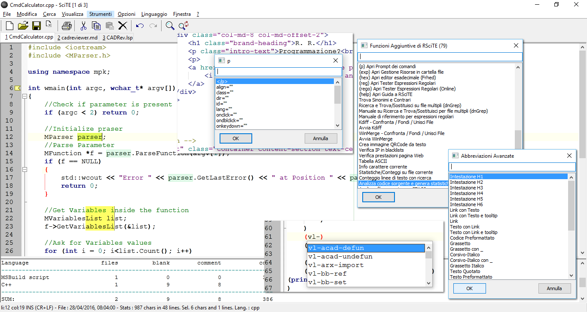

&nbsp;

### Ancora su SciTE

Nonostante SciTE faccia un "mestiere" comune a molti altri software
(l’editor di testo), la sua impostazione e le sue caratteristiche lo
differenziano radicalmente da qualsiasi altro.

Ad un primo approccio, SciTE appare semplice e "scarno", con un’interfaccia
essenziale, nella quale trovano posto un menu, poche icone e un’ampia area
di lavoro.

Dai menu è possibile accedere a gran parte delle funzionalità del programma,
molte delle quali accessibili anche attraverso semplici combinazioni di tasti.

Una delle peculiarità di SciTE è proprio l’ampio utilizzo delle combinazioni
di tasti. Questa caratteristica si pone lo scopo di consentire la modifica del
testo senza mai staccare la mani dalla tastiera, migliorando il livello di
efficienza e produttività, consentendo così all’operatore di mantenere la
concentrazione sul proprio lavoro senza distrarlo con l’utilizzo di mouse,
icone, menu ecc...

Tale approccio non penalizza in alcun modo le funzionalità del software che
rimangono ad alti livelli, certamente paragonabili con quelle di altri prodotti
ben più blasonati e costosi.

Un’altra caratteristica distintiva di SciTE è la quasi totale assenza di
maschere di configurazione. Questa "mancanza", di fatto contribuisce a
ridurre la complessità delle interfacce, riducendo così, anche i tempi di
sviluppo del programma. Al tempo stesso consente di aumentare, in modo
significativo, il numero di parametri configurabili, che attualmente sono
moltissimi.

Tutte le configurazione dell’editor sono memorizzate all’interno di
semplici file di testo, modificabili a piacere dall’utente.

Anche se a prima vista questo sistema può disorientare, grazie alla
dettagliata documentazione, accessibile attraverso l’uso dell’apposito
menu di aiuto, è possibile intervenire su questi file in modo rapido ed
immediato.

A tutto ciò va poi aggiunta la possibilità di utilizzare un vero e proprio
linguaggio di programmazione ([LUA](http://www.lua.org)), 
per implementare nuove funzioni o estendere quelle già presenti.

Infine, non è da sottovalutare la possibilità di usare l’editor
direttamente da un dispositivo rimovibile come, ad esempio, un pendrive USB,
senza quindi essere costretti ad effettuare alcuna installazione.

Grazie alle possibilità offerte, SciTE può essere utilizzato sia dal
neofita, sia dall’utente esperto o dal programmatore, traendo comunque
vantaggi significativi dalla sua potenza e dalla sua essenzialità.

In pratica, SciTE, si candida ad essere il sostituto sia del classico "Blocco
Note" sia degli editor professionali utilizzati nello sviluppo delle
applicazioni software.

&nbsp;

### Le Caratteristiche Base di SciTE

Ecco qui riassunte le caratteristiche principali della versione originale di
SciTE, tutte presenti anche in **RSciTE**.

Utilizzo Documenti:

* **Interfaccia MDI** per lavorare con più documenti contemporaneamente.
* Passaggio tra documenti utilizzando delle semplici schede.
* Utilizzo della combinazione **Ctrl+Tab** per cambiare il documento attivo.
* Possibilità di trascinare i documenti nell’editor per aprirli.
* Riconoscimento automatico modifica documenti aperti. Se un file aperto viene
modificato all’esterno dell’editor, viene rilevata la modifica ed è possibile
ricaricarlo automaticamente.

Sintassi evidenziata:

* Configurabile tramite appositi file (.properties).
* Preimpostato per riconoscere i linguaggi MQL, AutoCAD/IntelliCAD/progeCAD DCL,
AutoCAD/IntelliCAD/progeCAD Lisp, Abaqus, Ada, ANS.1 MIB definition files,
APDL, Assembler (NASM, MASM), Asymptote, AutoIt, Avenue, Batch files (MS-DOS),
Baan, Bash, BlitzBasic, Bullant, C/C++/C#, Clarion, cmake, COBOL,
Coffeescript, conf (Apache), CSound, CSS, D, diff files, E-Script, Eiffel,
Erlang, Flagship (Clipper / XBase), Flash (ActionScript), Fortran, Forth, GAP,
Gettext, Go, Haskell, HTML, HTML with embedded JavaScript, VBScript, PHP and
ASP, Gui4Cli, IDL - both MSIDL and XPIDL, INI, properties and similar,
InnoSetup, Intel HEX, Java, JavaScript, JSON and JSON-LD, KiXtart, LISP, LOT,
Lout, Lua, Make, Matlab, Maxima, Metapost, MMIXAL, MSSQL, Modula 3, Nimrod,
nnCron, NSIS, Objective C, Objective Caml, Opal, Octave, Pascal/Delphi, Perl,
most of it except for some ambiguous cases, PL/M, Progress, PostScript,
POV-Ray, PowerBasic, PowerShell, PowerPro, PureBasic, Python, R, Rebol,
Registry, Ruby, Rust, Scheme, scriptol, SORCUS Installation, Specman E, Spice,
Smalltalk, SQL and PLSQL, S-Record, Swift, TADS3, TeX and LaTeX, Tcl/Tk, Vala,
VB and VBScript, Verilog, VHDL, XML, YAML, Raku(Perl 6), DataFlex.
* Evidenziazione dinamica parentesi.
* Folding del codice sorgente con possibilità di scegliere la simbologia per la
visualizzazione.
* Supporto per la modalità di Codifica documenti a 8 Bit, Metodo UCS-2 Big Endian,
Metodo UCS-2 Little Endian, Metodo UTF-8, Metodo UTF-8 Cookie.
* Esportazione file in (mantenendo la colorazione della sintassi) HTML, RTF, PDF,
LaTeX, XML.
* Modalità di gestione fine linea con CR+LF, solo CR, solo LF.
* Gestione Conversione tra sistemi differenti.
* Gestione Sessioni di lavoro con salvataggi sessione corrente e caricamento
sessione salvata.
* Annulla e Ripristina a più livelli. Tutte le modifiche vengono registrate e
possono essere annullate, le operazioni annullate possono essere facilmente
ripristinate.
* Ricerca e Sostituzione con ricerca testo specificato ed eventuale sostituzione,
ricerca Incrementale testo specificato, ricerca testo con marcatori, supporto delle
espressioni regolari, ricerca in più file simultanea, evidenziazione automatica del
testo trovato.
* Funzioni avanzate nella gestione del codice sorgente come ricerca e selezione
parti di codice utilizzando la definizione della sintassi, gestione completamento
automatico parole, gestione completamento automatico con suggerimenti sintassi in
base al linguaggio, gestione abbreviazioni personalizzate, gestione Segnalibri
(bookmarks), gestione commenti, conversione Maiuscolo/Minuscolo, divisione ed
Unione Paragrafi.
* Scripting attraverso l’utilizzo del linguaggio di programmazione LUA.
* Visualizzazione in modalità Schermo Intero, con barra di icone, barra documenti
aperti, barra di stato personalizzabile. Gestione blocchi di codice con espansione
e compressione, fine riga e spazi, gestione guide di indentazione, numeri di riga,
margini e margini di blocco, possibilità di modificare il livello di zoom(per
ridurre o ingrandire il testo dinamicamente).
* Supporto strumenti con gestione finestra di Output, gestione compilatori e
programmi esterni.
* Editazione e Selezione con ritorno a capo automatico, selezione in modalità
colonna, selezione caratteri virtuali (fine linea), selezione Multipla, consente di
selezionare contemporaneamente più di testo, consentendone le classiche operazioni
di copia/incolla/ecc...
* Altre funzionalità includono la stampa a colori, la modalità sola lettura,
modalità finestra in primo piano, configurazione indentazione, possibilità di
automatizzare processi tramite l’uso dei parametri della linea di comando,
interfaccia di programmazione per il collegamento a software esterni 
e molto altro...

&nbsp;

### Le Scorciatoie da Tastiera

Come ogni editor che si rispetti, anche **RSciTE** dispone di una vasta schiera di
combinazioni di tasti per accedere alla funzionalità più utilizzate. Molte
delle combinazioni disponibili sono comuni agli ambienti Windows e Linux.
Inoltre, tutte le combinazioni di tasti sono ridefinibili attraverso
l’editazione di appositi file di configurazione. 

Molte delle combinazioni disponibili sono ereditate da SciTE, mentre altre
sono proprie della distribuzione RSciTE.

Per conoscere i tasti veloci disponibili è possibile consultare le tendine dei 
menu presenti nel programma, oppure leggere questa tabella riassuntiva:

* **Ctrl+O**.Apri file.
* **Ctrl+Maiusc+O**.Apri il file selezionato.
* **Ctrl+R**.Ricarica documento corrente.
* **Ctrl+W (oppure Ctrl+F4)**.Chiudi documento corrente.
* **Ctrl+S**.Salva.
* **Ctrl+Maiusc+S**.Salva con nome...
* **Ctr+Maiusc+P**.Salva una copia del documento corrente.
* **Ctrl+P**.Stamp.
* **Ctrl+Z**.Annulla.
* **Ctrl+Y**.Ripristina.
* **Ctrl+X**.Taglia Selezione.
* **Ctrl+C**.Copia Selezione.
* **Ctrl+V**.Incolla Selezione.
* **Canc**.Cancella.
* **Ctrl+A**.Seleziona tutto.
* **Ctrl+E**.Cerca parentesi graffa corrispendente.
* **Ctrl+Maiusc+Spazio**.Seleziona fino alla parentesi graffa.
* **Ctrl+I**.Completa Simbolo.
* **Ctrl+Invio**.Completa Parola corrente.
* **Ctrl+B**.Espandi Abbreviazione.
* **Ctrl+Maiusc+R**.Inserisci Abbreviazione.
* **Ctrl+Q**.Aggiungi o elimina il commento ad un blocco di testo.
* **Ctrl+Maiusc+B**.Inscatola Commento.
* **Ctrl+Maiusc+Q**.Versa Commento.
* **Ctrl+Maiusc+U**.Rendi la selezione MAIUSCOLA.
* **Ctrl+U**.Rendi la selezione minuscola.
* **Ctrl+F**.Trova...
* **F3**.Trova Successivo.
* **Maiusc+F3**.Trova Precedente.
* **Ctrl+Maiusc+F**.Cerca nei file...
* **Ctrl+H**.Trova e Sostituisci.
* **Ctrl+Alt+I**.Ricerca Incrementale.
* **Ctrl+G**.Vai a...
* **F2**.Vai al segnalibro successivo.
* **Maiusc+F2**.Vai al segnalibro precedente.
* **Ctrl+F2**.Attiva/Disattiva segnalibro.
* **F11**.Visualizzazione a Schermo Intero.
* **Ctrl+Maiusc+8**.Visualizza/Nascondi Spazi e Tabulazioni.
* **Ctrl+Maiusc+9**.Visualizza/Nascondi caratteri di Fine Linea.
* **F8**.Visualizza/Nascondi finestra di Output.
* **Maiusc+F8**.Parametri.
* **Ctrl+F7**.Compila.
* **F7**.Genera.
* **F5**.Esegui.
* **F4**.Messaggio successivo.
* **Maiusc+F4**.Messaggio precedente.
* **Maiusc+F5**.Cancella contenuto finestra di Output.
* **Ctrl+F6**.Cambia pannello attivo.
* **Ctrl+Maiusc+I**.Configurazione Indentazione....
* **Ctrl+F11**.Usa caratteri a spaziatura fissa.
* **Maiusc+F6**.Documento Precedente.
* **F6**.Documento Successivo.
* **F1**.Aiuto/Manuale(dipendente dal tipo di file aperto).
* **Ctrl+Keypad+**.Ingrandisci dimensione testo.
* **Ctrl+Keypad-**.Riduci dimensione testo.
* **Ctrl+Keypad/**.Ripristina dimensione originale testo.
* **Ctrl+Tab**.Cambio documento attivo.
* **Tab**.Indentazione blocco di testo.
* **Maiusc+Tab**.Elimina indentazione blocco.
* **Ctrl+BackSpace**.Eliminazione da inizio parola.
* **Ctrl+Delete**.Eliminazione fino a fine parola.
* **Ctrl+Maiusc+BackSpace**.Eliminazione testo da inizio linea a posizione cursore.
* **Ctrl+Maiusc+Delete**.Eliminazione testo da posizione corrente a fine linea.
* **Ctrl+Home**.Vai a inizio documento.
* **Ctrl+Maiusc+Home**.Estendi selezione fino a inizio documento.
* **Alt+Home**.Vai a inizio linea.
* **Alt+Maiusc+Home**.Estendi selezione fino a inizio linea.
* **Ctrl+End**.Vai alla fine del documento.
* **Ctrl+Maiusc+End**.Estendi selezione fino alla fine del documento.
* **Alt+End**.Vai alla fine della linea corrente.
* **Alt+Maiusc+End**.Estendi selezione fino a fine riga corrente.
* **Ctrl+Keypad***.Espandi o contrai punto di ’fold’.
* **Ctrl+F2**.Crea o elimina segnalibro (bookmark).
* **F2**.Vai al prossimo segnalibro.
* **Alt+F2**.Seleziona fino al prossimo segnalibro.
* **Ctrl+F3**.Cerca testo selezionato nel documento corrente.
* **Ctrl+Maiusc+F3**.Cerca testo selezionato nel documento corrente (a ritroso).
* **Ctrl+Freccia Su**.Scorri documento verso l’alto.
* **Ctrl+Freccia Giu**.Scorri documento verso l’alto.
* **Ctrl+L**.Taglia linea corrente.
* **Ctrl+Maiusc+T**.Copia linea corrente.
* **Ctrl+Maiusc+L**.Elimina linea corrente.
* **Ctrl+T**.Scambia linea corrente con precedente.
* **Ctrl+D**.Duplica linea corrente.
* **Ctrl+K**.Cerca corrispondenza su condizione preprocessore.
* **Ctrl+Maiusc+K**.Seleziona corrispondenza su condizione preprocessore.
* **Ctrl+J**.Cerca corrispondenza su condizione preprocessore (a ritroso).
* **Ctrl+Maiusc+J**.Seleziona corrispondenza su condizione preprocessore (a ritroso).
* **Ctrl+’**.Vai al paragrafo precedente.
* **Ctrl+Maiusc+’**.Estendi selezione fino al paragrafo precedente.
* **Ctrl+ì**.Vai al paragrafo successivo.
* **Ctrl+Maiusc+ì**.Estendi selezione fino al paragrafo successivo.
* **Ctrl+Freccia Sinistra**.Vai a parola precedente.
* **Ctrl+Maiusc+Freccia Sinistra**.Espandi selezione fino a parola precedente.
* **Ctrl+Freccia Destra**.Vai a parola successiva.
* **Ctrl+Maiusc+Freccia Destra**.Espandi selezione fino a parola successiva.
* **Ctrl+ù**.Vai alla parte precedente della parola corrente.
* **Ctrl++Maiusc+ù**.Espandi la selezione fino alla parte precedente della parola corrente.
* **Ctrl+**.Vai alla parte successiva della parola corrente.
* **Ctrl+Maiusc+**.Espandi selezione fino alla parte successiva della parola corrente.
* **Ctrl+(tastierino numerico +/-)**.Ingrandimento/Riduzione dimensione caratteri
(disponibile solo in "RSciTE").
* **Ctrl+F1**.Ricerca contestuale online
(disponibile solo in "RSciTE").
* **Ctrl+Alt+O**.Lista ultimi file utilizzati 
(disponibile solo in "RSciTE").
* **F12**.Funzionalità avanzate
(disponibile solo in "RSciTE").
* **Ctrl+<**.Inserimento abbreviazione/modello 
(disponibile solo in "RSciTE").
* **Ctrl+Alt+C**.Copia testo in Appunti Multipli 
(disponibile solo in "RSciTE").
* **Ctrl+Alt+X**.Taglia testo ed inseriscilo in Appunti Multipli 
(disponibile solo in "RSciTE").
* **Ctrl+Alt+V**.Incolla testo da Appunti Multipli 
(disponibile solo in "RSciTE").
* **Ctrl+Alt+N**.Crea nuovo file con il contenuto del pannello di output 
(disponibile solo in "RSciTE").
* **Shift+F1**.Permette di visualizzare le informazioni sulla versione di RsciTE
che si sta utilizzando, inoltre consente di accedere alla procedura di
aggiornamento 
(disponibile solo in "RSciTE").

&nbsp;

### Il Linguaggio di programmazione LUA

**LUA è un potente linguaggio di scripting, integrato in SciTE!**

Da tempo, SciTE, include un vero e proprio linguaggio di programmazione che
consente di potenziare l’editor in modo flessibile ed immediato.

**LUA** è un linguaggio di scripting di utilizzo generico, snello, potente e
flessibile. Offre un buon supporto per la programmazione object-oriented, per
la programmazione funzionale e per quella orientata ai dati.

**LUA** è disponibile sia come linguaggio interpretato a se stante, sia come
libreria ed è scritto utilizzando il linguaggio C, cosa che lo rende adatto
all’utilizzo su molti sistemi operativi.

**LUA** è inoltre caratterizzato da una sintassi semplice ed immediata che, per
alcuni aspetti, ricorda quella del linguaggio Basic. A differenza di
quest’ultimo **LUA** è estremamente rapido ed efficiente nel’esecuzione degli
script.

Proprio grazie a queste caratteristiche l'autore di SciTE hanno deciso di
integrarlo nell'editor, dando agli utenti la possibilità di estendere e
di potenziare il programma.

Per chiarire meglio le potenzialità di **LUA** all’interno di SciTE, ecco un
esempio tratto dalla distribuzione **RSciTE** che effettua l’ordinamento del
file corrente:

    Author  : Roberto Rossi
    Web     : http://www.redchar.net
    Questa procedura ordina il file corrente]]
    do
     local tbLinee = { } −−tabella file

     local function insertLinea( idx, linea )
       editor:AddText(linea)
     end

     local function OrderCurrentBuffer()
       local linea,pos
       local i=0
       linea = editor:GetLine(i)
       while linea do
         tbLinee[i] = linea
         i = i + 1
         linea = editor:GetLine(i)
       end
       table.sort(tbLinee)
       editor:ClearAll()
       table.foreach(tbLinee, insertLinea)
     end
     OrderCurrentBuffer()
     print("Ordinamento File Concluso con successo.")
    end

Per approfondire le proprie conoscenze su **LUA** e sul suo utilizzo, si consulti
la sezione **Siti Utili**.

&nbsp;

### SciTE al Lavoro

**RSciTE** editando un file .cpp (linguaggio C++):

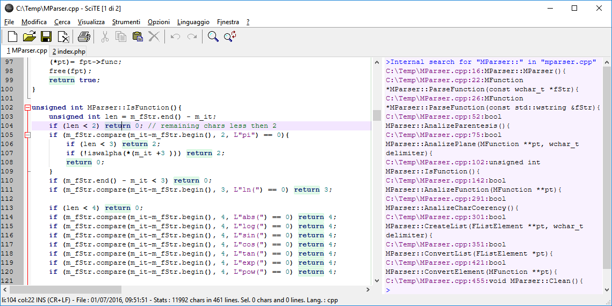

**RSciTE** editando un file .lsp (linguaggio Lisp):

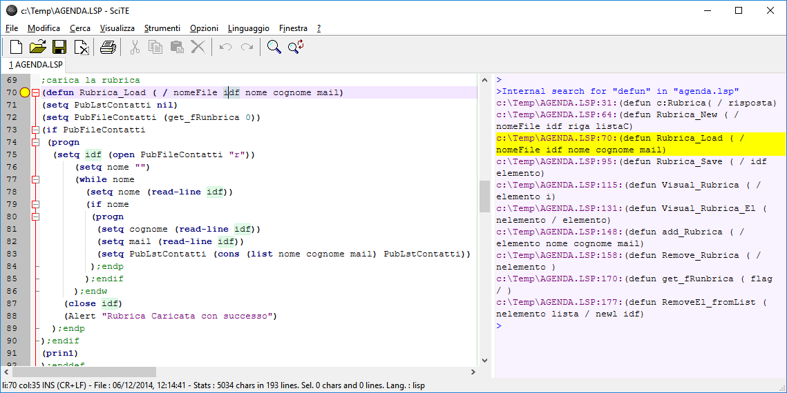

**RSciTE** editando un file .php (linguaggio PHP), con l’**autocompletamento** attivo:

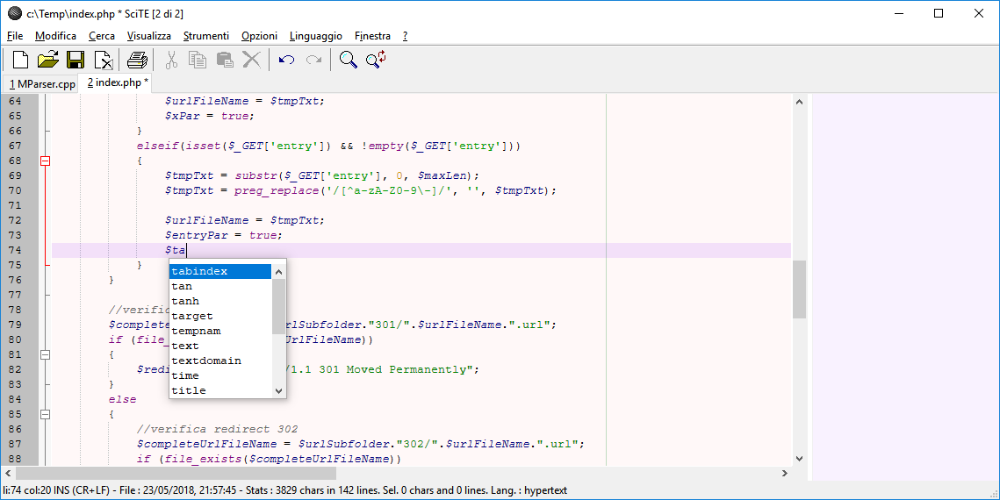

**RSciTE** editando un file .php (linguaggio PHP), con l’aiuto sulla **sintassi**:

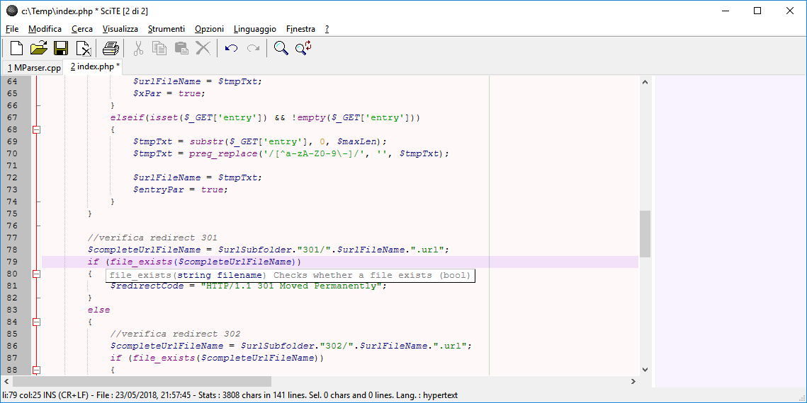

&nbsp;

### RSciTE

SciTE viene distribuito sia in formato sorgente sia in forma compilata, per
Windows e per Linux. Purtroppo, chi si accosta per la prima volta a SciTE può
rimanere deluso in quanto, l’editor non prevede un’installatore, nè in
lingua inglese, nè in italiano, non viene prevista alcuna forma di
integrazione con il sistema, infine, le impostazioni di default risultano,
alle volte, insufficienti per gli utilizzi avanzati. Insomma, il primo
approccio non è dei migliori.

Per sopperire a queste piccole carenze, l’utente può personalizzare
l’editor manualmente, oppure può affidarsi a una delle distribuzioni
alternative di SciTE.

**RSciTE** è una di queste distribuzioni alternative. La sua
caratteristica principale è quella di essere indirizzata **all’utente
italiano che opera in ambiente Windows**. Realizzata da **Roberto Rossi**
(<http://www.redchar.net>) si pone come obbiettivo
quello di promuovere **SciTE** come editor di testo per tutti gli usi.

Alle volte modificando semplicemente le configurazione, in altri casi,
sfruttando il suo linguaggio di programmazione interno **LUA**,
**RSciTE** include una serie di funzionalità aggiuntive per aumentare (dove
necessario) la produttività dell’editor.

Inoltre, nella distribuzione **RSciTE** sono inseriti altri software che,
uniti all’editor di testo, permettono di ottenere un formidabile strumento
di editazione e di gestione.

&nbsp;

### Funzionalità Aggiuntive in RSciTE

Questo elenco mostra le funzionalità presenti e sviluppate esclusivamente per
**RSciTE**:

* **F12**, gruppo di funzioni generiche per l’editazione del testo,
raggiungibili mediante il tasto **F12**. Per maggiori dettagli si consulti
la sezione **F12**.
* Sistema per inserimento abbreviazioni avanzate, tramite la combinazione di
tasti **Ctrl+<**.
* **Inserimento assistito proprietà dei TAG HTML**. Attraverso l’utilizzo
della combinazione di tasti **Ctrl+-**, all’interno dei file HTML/XML
ecc..., si accede ad una tendina di suggerimento che permette la scelta
dell’attributo da inserire.
* Integrato **HTML TIDY** per la formattazione automatica dei file HTML/XML.
Per maggiori dettagli si consulti la sezione **HTML Tidy.**
* Aggiunto **riconoscimento e colorazione sintassi** per il linguaggio
**LISP** utilizzato in questi software:
* Integrato sistema di **suggerimenti** per il linguaggio **LISP**
utilizzato in questi software:
* Aggiunta **sintassi** per il linguaggio **DCL** utilizzato in molti CAD,
ad esempio in AutoCAD, progeCAD e in tutti i CAD compatibili.
* Integrato il sistema di **suggerimenti** per il linguaggio **DCL**.
* Integrato **completamento automatico per HTML**
* Integrato sistema di **suggerimenti per PHP**
* Integrato **completamento automatico per PHP**
* **Riconoscimento file di PHP-GTK**
* **Personalizzazione e aggiornamento** file di supporto per il riconoscimento
del linguaggio **Visual Basic.NET/VB/VBA/VBS**
* Supporto **completamento automatico per Visual Basic.NET/VB/VBA/VBS**
* Supporto sistema di **suggerimenti per Visual Basic.NET/VB/VBA/VBS**
* **Tabella ASCII**. Nei momenti di necessità è possibile consultare una
comoda tabella con i 255 caratteri standard.
* Supporto abbreviazioni per i seguenti linguaggi:
* Supporto sistema di **suggerimenti per linguaggio LUA**
* Integrato **manuale per linguaggio LUA**
* **Editor Esadecimale FRhed** (versione per Windows). Accessibile da **F12**,
permette l’editazione del file corrente in formato Esadecimale.
* Software per il confronto e per l’unione di file, **WinMerge**.
Accessibile da **F12**, permette il confronto di file e cartelle.
* Integrazione con il **menu contestuale di Windows**.
* **Procedura di installazione**, in lingua italiana, per i sistemi Windows
(XP / Vista / 7 / 8 / 10 o successivi), con possibilità di personalizzazione
delle funzionalità da attivare.
* **File LISP: Esegui in CAD. **Nei file LSP (Lisp) è possibile utilizzare
il tasto F5 per caricare il file corrente nel CAD aperto al momento.
* **Interprete Diretto Espressioni Lua.** In questo modo sarà possibile
testare direttamente una linea di codice Lua senza dover creare un apposito
script.
* **Convertitore Testo→Abbreviazione/Template.** Aiuta a creare le macro da
inserire con SciTE.
* **Elenco TODO**. Consente di elencare tutte le linee che rappresentano gli
elementi da completare nel file di testo corrente
* **Apertura Gestione Risorse**. Nel caso si renda necessario, direttamente da
SciTE è possibile aprire il gestione risorse o il risorse del comuper di
Windows posizionato sulla cartella del file corrente.
* **Gestore Trasparenza finestra di SciTE. **E’ possibile modificare il
livello di trasparenza della finestra dell’editor in modo da poterlo
utilizzare in ogni situazione.
* **Gestore Appunti Multipli**. Grazie alla gestione di più appunti sarà
possibile salvare e riutilizzare semplicemente i nostri spezzoni di testo più
utili.
* **Gestore Avanzato Segnalibri/Bookmarks. **
* **Ricerca Contestuale Online (CTRL+F1)**
* **Trova/Sostituisci su file multipli**. Una potente funzione di ricerca e
sostituzione che si affianca alla gia validà procedura interna di SciTE.
* **Inserimento BOM per file con codifica Unicode**. Alle volte capita di
scontrarsi con file non correttamente formattati, magari unicode ai quali
manca una intestazione valida. Questa funzione risolve il problema.
* **Conversione valori decimali-esadecimali-binari**. Un piccolo convertitore
interno che permette la trasposizione di due semplici numeri.
* **Non siamo mica qui...** Una funzione simpatica, ma con nessuna utilità pratica.
* **Disegna/Calcola espressione matematica**. Tramite questa funzione, data
un’espressione matematica completa, sarà possibile rappresentarla
graficamente utilizzando alcuni servizi online.
* **Opzioni RSciTE**. Dal menu strumento è disponibile una funzione per la 
configurazione semplificata di SciTE. Tramite una semplice maschera di dialogo
sarà possibile impostare i parametri operativi dell'editor di testo senza
essere costretti ad agire direttamente sui file di configurazione.
* Oltre a quanto riportato in questo elenco, sono presenti molte modifiche,
secondarie, alle impostazioni di base (es.: margini, numeri linea ecc..).

&nbsp;

### F12

In questa sezione sono elencate le funzionalità fornite dalla funzione **F12**,
presente nella distribuzione **RSciTE**.

**F12** ovviamente è richiamabile con l'omonimo tasto **F12**.

&nbsp;

### Funzionalità Avanzate per la modifica dei file di testo

Alle volte, durante il lavoro quotidiano, si sente la mancanza di alcune
funzionalità previste da altri editor e che SciTE ancora non supporta.

Per sopperire a tale mancanza, sfruttando il potente linguaggio interno a
SciTE (LUA), **RSciTE** prova ad includere ciò che manca.

&nbsp;

### E’ nato F12!

**F12** prende il suo nome dal tasto che lo richiama, e più che di una singola
funzione, **F12** può essere visto come insieme di utilità per la manipolazione
del testo. Alla pressione dell’omonimo tasto ( **F12** ), apparirà l’apposita
dialog per la scelta del comando da eseguire:

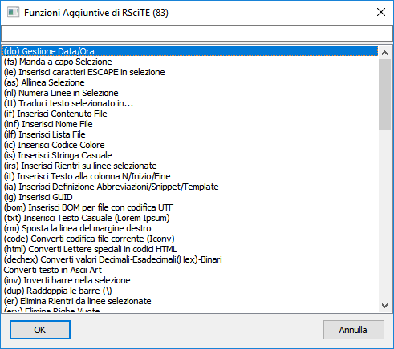

Attenzione: solo una piccola parte dei comandi disponibili è presente in
questa schermata!

Data la mole di funzioni presenti in **F12** la maschera di selezione è
dotata di una comoda casella nella quale l’utente può inserire un testo, che
servirà ad **RSciTE** per mostrare solo le funzioni che lo riportano. Ad esempio,
se volessimo vedere tutte le funzioni riguardanti i l’eliminazione di testo ci
basterebbe inserire la parola "elimina", in questo modo:

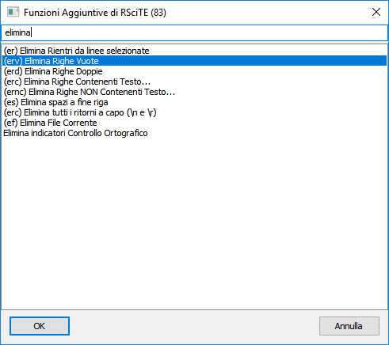

&nbsp;

### Cosa contiene F12

* **Gestione Data/Ora** Questa funzione permette l’inserimento della data e
dell’ora corrente, con la possibilità di scegliere il formato che la
rappresenta, compreso lo speciale formato TIMESTAMP. Per consentire la massima
flessibilità l’utente può personalizzare la modalità di inserimento
aumentando il numero di formati disponibili. In aggiunta, la procedura prevede
modalità particolari per la conversione di date generiche in formato
TIMESTAMP e viceversa.
* **Formattazione selezione**. Selezionando un testo è possibile chiedere al
software l’inserimento automatico dei ritorni a capo ad una determinata
colonna. Questa funzionalità di formattazione consente di scegliere la
colonna oppure di utilizzare il delimitatore destro (solitamente visibile).
* **Inserimento caratteri ESCAPE in selezione**. Alcuni linguaggi prevedono,
all’interno delle stringhe, l’uso di caratteri speciali (chiamati di
Escape). Con questo comando è possibile convertire i normali caratteri in
caratteri di Escape. Ad esempio : Ritorno a capo = \n, Tabulazione = \t ecc...
* **Allineamento Selezione**. L’allineamento della selezione consente di
posizionare le linee a destra/sinistra/centro, come nei normali elaboratori di
testo, operazione utili quando si desidera dare un aspetto migliore ai propri
scritti. Questa funzione permette anche l’utilizzo di riempimenti per la
riga formattata.
* **Numerazione Linee in Selezione**. Alle volte, risulta utile inserire il
numero di linea prima del testo della stessa. Questo comando permette di
finserire questo dato, consentendo all’operatore di stabilire come, lo
stesso numero, debba essere formattato.
* **Inserimento File**. Questa funzione consente l’inserimento, nella
posizione corrente del cursore, di un intero file scelto da un’apposita
maschera.
* **Inserimento Lista File**. Con questa procedura è possibile inserire
l’elenco dei file presenti in una determinata cartella. E’ possibile
scegliere quali file elencare attraverso l’uso dei normali caratteri
speciali (* ? ecc...), inoltre è consentito stabilire come rappresentare il
nome dei file inseriti.
* **Inserimento Codice Colore**. Scegliendo il colore dalla maschera standard
di selezione è possibile inserire il suo codice all’interno del documento
corrente, nella posizione del cursore. Una volta scelto il colore sarà
possibile indicare il formato per l’inserimento (RGB decimale o RGB
Esadecimale).
* **Inserimento Stringa Casuale**. Con questa funzione è possibile inserire
una stringa casuale, scegliendone la composizione, lunghezza e la
rappresentazione (solo numeri, numeri + lettere, formato esadecimale, ecc...).
* **Inserimento Rientri su linee selezionate**. Con questo comando è
possibile inserire dei rientri a sinistra della selezione corrente, così da
poter allineare, in modo semplice, diversi blocchi di testo tra loro.
* **Inserisci Testo alla colonna N/Inizio/Fine**. Questa funzione consente
l’inserimento di testo nelle linee selezionate. E’ possibile decidere di
specificare una colonna nella quale verrà posizionato il testo indicato
oppure, quest’ultimo potrà essere inserito all’inizio o alla fine delle
linee.
* **Conversione Lettere speciali in codici HTML**. Questa funzione permette di
scrivere normalmente il testo nelle pagine HTML senza preoccuparsi delle
lettere accentate, infatti il suo utilizzo converte questi caratteri nei
corrispondenti codici HTML.
* **Eliminazione Rientri dalle linee selezionate**. Con questo comando è
possibile eliminare i rientri, eventualmente presenti alla sinistra del testo
selezionato.
* **Eliminazione Righe Vuote**. Questa funzione non fa altro che eliminare le
linee Vuote dal file corrente.
* **Eliminazione Righe Doppie**. Alle volte, può capitare di dover eliminare
eventuali righe doppie da un file di testo. Questa funzione esegue la
scansione del documento corrente eliminando eventuali doppioni.
* **Eliminazione Righe Contenenti Testo...** In modo simile al precedente,
questo comando elimina delle linee dal file corrente, richiedendo all’utente
di specificare un testo da ricercare, in corrispondenza del quale, verranno
fatte le cancellazioni.
* **Eliminazione Righe NON Contenenti Testo...** In modo simile al precedente,
questo comando elimina delle linee dal file corrente, richiedendo all’utente
di specificare un testo da ricercare, tutte le linee che NON contengono il
testo specificato verranno eliminate.
* **Eliminazione spazi a fine riga**. Spesso capita di trovare file contenenti
spazi o tabulazioni alla fine delle linee. Ciò provoca uno spreco di spazio e
rende più difficoltosa l’editazione. Questa funzione risolve il problema
eliminando ciò che è superfluo. Eliminazione spazi a fine riga Spesso capita
di trovare file contenenti spazi o tabulazioni alla fine delle linee. Ciò
provoca uno spreco di spazio e rende più difficoltosa l’editazione. Questa
funzione risolve il problema eliminando ciò che è superfluo.
* **Ordinamento file corrente/selezione**. Nella mia ’vita da
programmatore’, mi è capitato più di una volta, di dover ordinare un file.
Questo comando ordina il file corrente con il classico metodo ASCII,
consentendo di scegliere se l’ordine debba essere crescente o decrescente.
* **Ridenominazione File Corrente**. Per rinominare il file corrente, senza
dover passare ad un file manager o al gestione risorse.
* **Elimina File Corrente**. Anche in questo caso, un’utilità che ci
consente di non utilizzare un gestore di file apposito, ma che elimina
definitivamente il file corrente.
* **Copia nome file corrente negli appunti**. In alcune circostanze, risulta
utile poter disporre del nome del file in editazione, in modo da poterlo
utilizzare nel testo o in altri software.
* **Inserimento Nome File**. E’ possibile utilizzare questa funzione per
inserire il nome del file corrente, comprensivo di percorso, nella posizione
del cursore.
* **Lista TODO**. Molte volte, all’interno dei file sorgente, vengono
utilizzato degli identificatori per annotare le cose da fare, gli errori da
correggere o le funzionalità da implementare. Questa funzione fornisce
l’elenco di questo note, eventualmente presenti nel file corrente. Sono
supportati i seguenti identificativi : "TODO :", "HACK :" e "UNDONE :"
* **Info carattere corrente**. Particolare funzione che consente di ottenere
informazioni specifiche sul carattere presente nella posizione del cursore. I
dati visualizzati si riferiscono al codice ASCII, al codice esadecimale e
all’offset del carattere analizzato.
* **Statistiche su file corrente**. Fornisce informazioni dettagliate sulla
selezione e sul file corrente. I dati visualizzati si riferiscono al conteggio
di Parole, Righe, Caratteri comprensivi di spazi e senza spazi, inoltre gli
stessi dati sono riportati per la selezione corrente.
* **Statistiche su testo**. Consente il conteggio di un parziale all’interno
del testo corrente. Permette sia il semplice conteggio di occorrenze e linee,
sia l’identificazione di queste ultime con segnalibri. Può lavorare sia
considerando, sia non considerando le differenze tra maiuscole e minuscole.
* **Imposta trasparenza finestra di SciTE**. Con questa funzionalità è
possibile rendere trasparente la finestra di SciTE, in modo che diventi, in
alcune circostanze, meno evidente. Questa funzione risulta utile soprattutto
quando SciTE viene posizionato sempre in primo piano, utilizzando l’apposita
opzione.
* **Analizza file corrente con CTAGS**. Attraverso l’utilizzo di CTAGS, il
file corrente viene analizzato e vengono mostrate le funzioni, le classi e le
variabile definite al suo interno. In questo modo è possibile identificare
immediatamente ogni elemento del sorgente editato.
* **Comprimi file CSS/JavaScript (YuiCompressor)**. YuiCompressor è
un’utilità scritta in linguaggio Java (e che necessita del relativo
runtime) che consente di ridurre le dimensioni di un qualsiasi file CSS e/o
JavaScript. La riduzione delle dimensioni avviene attraverso l’utilizzo di
alcune tecniche che, senza intaccarne il funzionamento, ne eliminano le parti
superflue riuscendo a diminuirne drasticamente le dimensioni. Di conseguenza
è possibile ridurre la dimensione delle nostre, care, pagine web,
velocizzandone la consultazione e rendendo la navigazione un’esperienza
migliore. Inoltre, YuiCompressor effettua anche l’offuscamento del sorgente,
in modo che questo sia di difficile comprensione e riutilizzo. Cosi facendo è
possibile limitare il rischio di uso non autorizzato del proprio lavoro.
* **Generatore GUID**. Questa funzione permette l’inserimento di una GUID
all’interno del testo corrente, consentendone la formattazione per adattarsi
a diverse situazioni di utilizzo.
* **Invertitore barre**. Questa piccola utilità consente l’inversione delle
barre presenti nel testo selezionato. Nella pratica, il carattere ’\’
sarà trasformato in ’/’ e viceversa.
* **Apertura prompt dei comandi**. E’ possibile aprire la finestra del
prompt dei comandi direttamente nella cartella del file corrente. Operazione
banale ma, alle volte, comoda per evitare di scomodare il menu dei programmi
del sistema operativo.
* **Sposta linea margine destro**. Questa funzionalità consente di
posizionare liberamente la linea relativa al margine destro del testo, questo
consente una migliore gestione delle funzioni di riformattazione e aiuta a
stabilire l’incolonnamento esatto di eventuali file formattati.
* **Controllo Ortografico**. Il controllo ortografico in RSciTE è finalizzato
alla correzione di semplici errori di digitazione. Con il programma sono
forniti due dizionari, uno per la lingua italiana e uno per la lingua inglese.
Le funzionalità implementate permettono l’individuazione delle parole
errate e la creazione di un proprio dizionario personalizzato. La procedura è
di tipo interattivo e segue l’utente passo passo nella selezione e nella
correzione dei termini errati.
* **Informazioni sulle Versioni...** Questo comando, fornisce i numeri di
versione per la distribuzione utilizzata di RSciTE, in questo modo è
possibile controllare lo stato di aggiornamento del software.
* **Controlla aggiornamenti di RSciTE**. Questa funzione si occupa di
controllare la presenza, su internet, di una nuova versione di RSciTE,
permette quindi di scaricare ed installare la nuova release.
* **Codifica/decodifica in Base64**. Consente di codificare a decodificare una 
stringa usando l’algoritmo BASE64.
* **Traduci testo selezionato in...** Utile per tradurre piccole frasi in
qualsiasi altra lingua supportata da Google Translator. Richiede una
connessione a internet attiva.
* **Confronta / Fondi / Unisci File**. Consente l’utilizzo di WinMerge per il 
confronto e la fusione di file e cartelle.
* **Apri Tester Espressioni Regolari (Online)**. Apre un apposito sito web,
interamente dedicato al test delle espressioni regolari.
* **Apri editor esadecimale**. Apre l’editor esadecimale con il file
corrente caricato.
* **Apri Gestione Risorse in cartella file**. Come “dice” la voce stessa,
apre il gestore file del sistema operativo nella cartella del file corrente.
* **Converti codifica file corrente (ICONV)**. Attraverso l’utilizzo
dell’utilità ICONV, RSciTE è in grado di convertire un file da una
codifica ad un’altra. Supporta piu di 100 codifiche diverse sia come
sorgente, sia come destinazione.
* **Crea immagine QRCode da testo**. Funzione in grado di convertire un testo
nel relativo codice QRCode. Questa funzionalità può sfruttare servizi online
oppure può funzionare in modo completamente indipendente.
* **Verifica IP in blacklists**. Verifica se l’IP specificato/selezionato è
presente in qualche blacklist internet„ sfruttando un apposito servizio
online.
* **Verifica prestazioni pagina Web**. Verifica le prestazioni della pagina
web spacificata/selezionata, sfruttando un apposito servizio online.
* **Converti testo in Ascii Art**. Utilizzando un apposito servizio web,
questa funzione permette di convertire un testo nella relativa forma di Ascii
Art.
* **Calcolatrice Windows**. Questa funzionalità permette di aprire la calcolatrice
del sistema operativo direttamente dall'interno di SciTE.
* **Calcolatrice Online**. Questa funzionalità permette di accedere ad una
calcolatrive avanzata utilizzabile online. Un software che fornisce funzionalità
avanzate rispetto alla normale calcolatrice di sistema.
* **Trova Sinonimi e Contrari**. Questa funzione, utilizzando un servizio
internet, fornisce l’elenco dei sinonimi e contrari della parola
selezionata/indicata.
* **Procedura di conteggio linee**. Questa funzione conta le linee che
corrispondono ai parametri di ricerca. E’ possibile contare le linee che
contengono o menu un testo, quelle che iniziano o terminano con un determinato
parziale ed è possibile inserire dei segnalibri sulle linee trovate.
* **Procedura per criptare e decriptare un file**. Con questa funzione,
sfruttando il famoso software libero **GNU Privacy Guard**, è possibile
criptare il file corrente e, ovviamente, decriptare il risultato per renderlo
nuovamente leggibile.
* **Gestione delle operazioni di Commit, Push e Log/History** sui software
**GIT Extensions, TortoiseGIT e TortoiseSVN**. In questo modo, senza
l’asciare l’editor di testo, sarà possibile utilizzare i comandi
fondamentali dei sistemi di gestione revisioni GIT e SVN.
* **Selezione rettangolare**. Una semplice funzione che consente, specificando
le coordinate in forma riga/colonna, di selezionare un’area rettangolare nel
testo.
* **Ricerca immagini online**. Una funzione che, date delle parole chiave,
effettua una ricerca su alcuni servizi online che forniscono immagini gratuite
da poter usare nei propri progetti.
* **Genera report informazioni di sistema**. Una funzionalità che permette di
creare un rapporto dettagliato sul sistema in uso tramite l'utilità standard
System Information.
* **Analizza colore**. Questa funzione permette di analizzare, tramite un
servizio web, il colore selezionato espresso in forma esadecimale o attraverso
il suo nome come espresso nelle pagine web html/css.
* **Unisci linee/testo selezionato su singola linea**. Dato un testo questo
viene portato su una singola linea eliminando qualsiasi ritorno a capo.
* **Elenca colori esadecimali utilizzati nel file corrente**. Con questa funzione
si può ottenere l'elenco dei colori utilizzati (espressi in forma esadecimale)
all'interno di un file html/css o simili.
* **Gestore temi/colori SciTE**. Questo comando permette di cambiare la combinazione
colori utilizzata dall'editor di testo.
* **Generazione Report Informazioni di sistema**. Permette la generazione di un
report relativo all'ardware e al software corrente. Sfrutta l'utilità
System Information di Windows.
* **Apertura file in nuova finesta**. Permette l'apertura del file corrente in
una nuova finestra di SciTE.
* **Generatore Password**. Con questa funzione è possibile generare delle password
casuali selezionando le caratteristiche della parola chiave da generare.
* **Accorcia indirizzo web selezionato**. Una semplice funzione che, grazie al
servizio offerto da Tinyurl.com riduce la lunghezza degli indirizzi web.
* **Converti codice sorgente in immagine**. Una funzione che, sfruttando un
servizio online converte un testo in una immagine.

In aggiunta a queste funzionalità, **F12** consente all’utente la
realizzazione degli script personalizzati e la loro integrazione direttamente
all’interno del pannello principale, senza alcuno sforzo, attraverso
l’utilizzo dell’apposita funzione, posta al termine dell’elenco di
**F12**.

&nbsp;

### Ricerca Contestuale alternativa in RSciTE

**RSciTE** incorpora una particolare funzione che gli consente di cercare un
testo su vari siti web in base alla selezione fatta nell’editor.

In questo modo potremo utilizzare tutti quei servizi web informativi, utili
per il Nostro lavoro. Il software aprirà automaticamente il browser web,
effettuando la ricerca direttamente sul sito desiderato.

Questa funzione riesce, molte volte, ad essere più utile e flessibile del
normale aiuto contestuale eseguito attraverso i normali canali off-line (es.:
documentazione .chm).

Prima di osservare alcuni esempi, bisogna sapere che la funzionalità di
ricerca contestuale può essere richiamata attraverso la combinazione di tasti
**CTRL+F1**, oppure dal menu Strumenti alla voce **Ricerca Web**.

Richiamando la funzione di ricerca web apparirà una semplice maschera nella
quale sarà possibile selezionare il sito/servizio sul quale effettuare
l’operazione di ricerca:

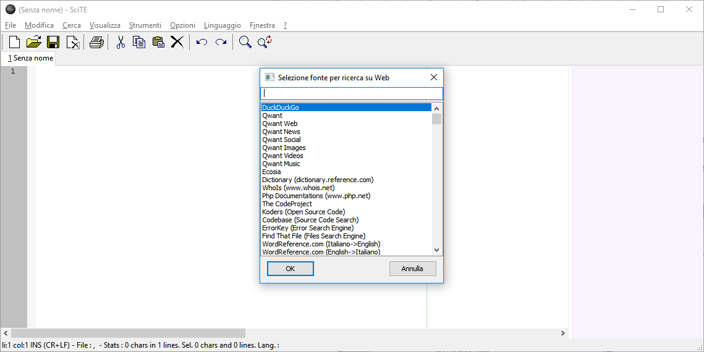

Facciamo ora alcuni esempi, iniziando da un file .PHP. Basta selezionare parte
del testo, in questo caso la funzione *file_exist*, quindi premere **CTRL+F1** e
selezionare Php:

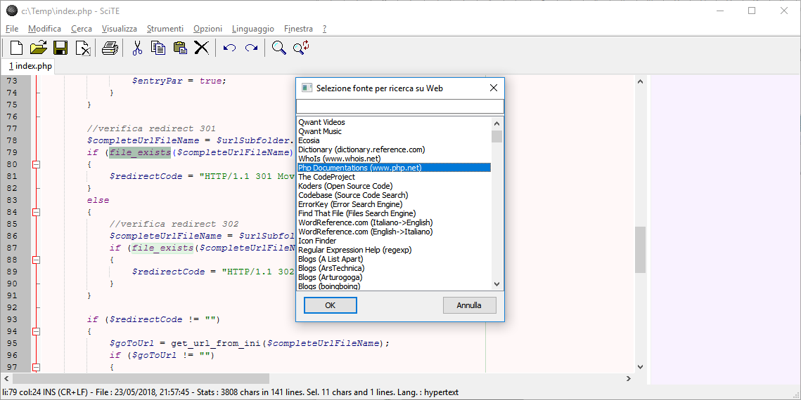

Una volta premuto su **Ok**, oppure con un doppio clic sulla voce desiderata,
verrà aperto il browser alla pagina voluta:

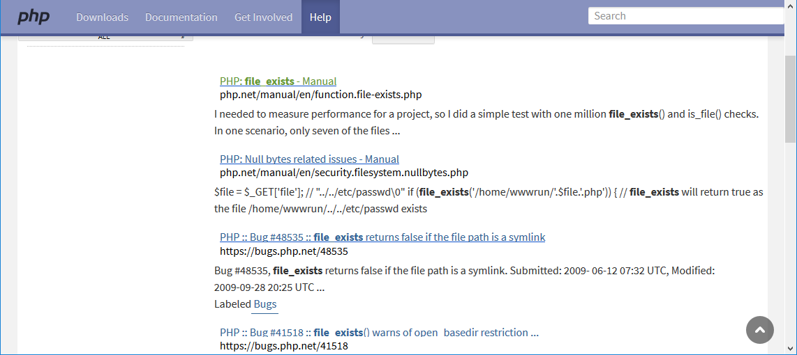

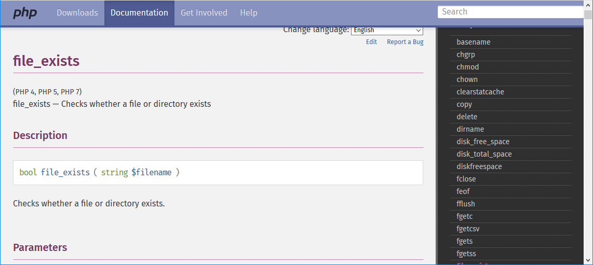

Proviamo ora con una funzione C standard, **sprintf**, utilizzando il sito
web **www.cplusplus.com**:

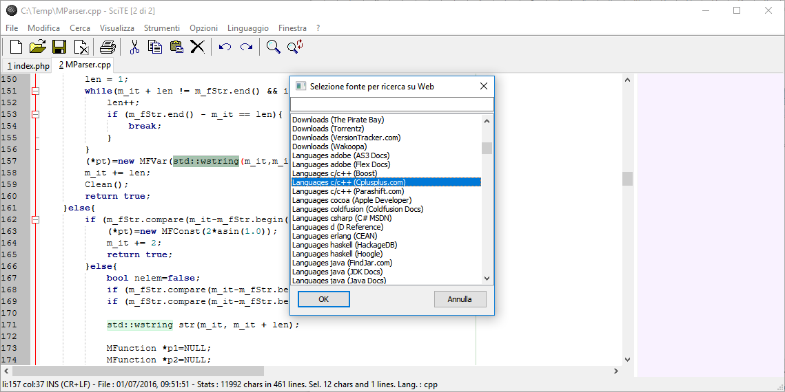

Oppure, possiamo provare con una funzione di Windows e il servizio fornito da
Microsoft (Developer):

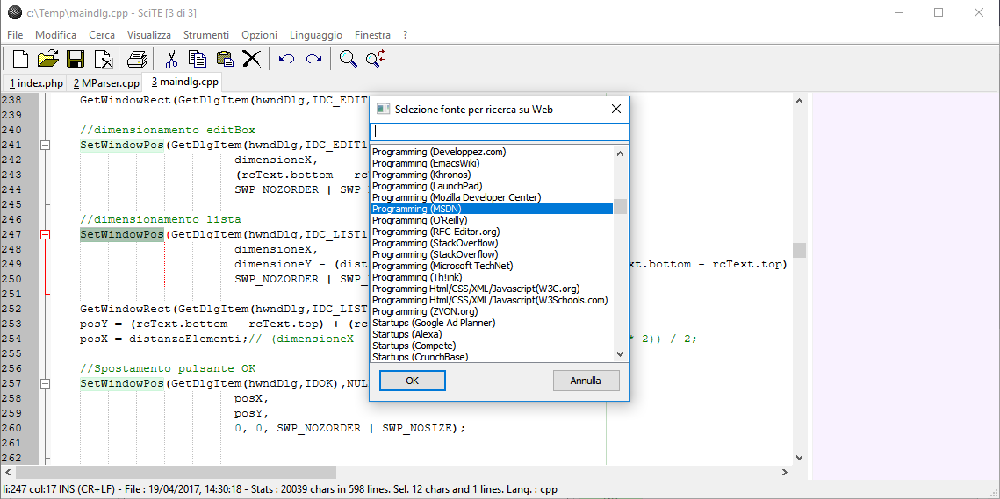

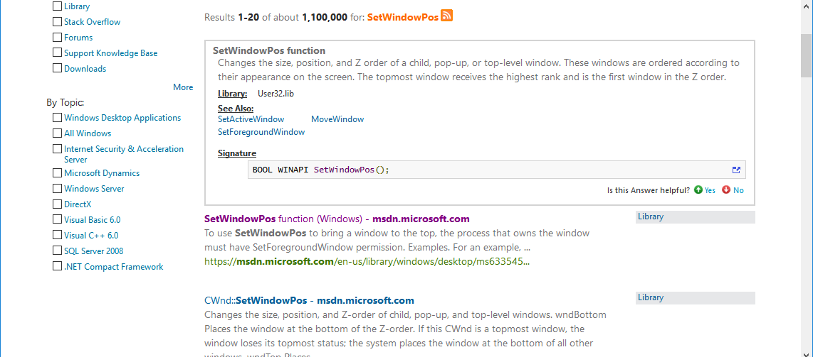

&nbsp;

### Tools Aggiuntivi presenti in RSciTE

Nella distribuzione **RSciTE** sono stati introdotti una serie di software
aggiuntivi, al fine di potenziare gli strumenti di modifica del testo.

Tali software, sono disponibili, sia in forma indipendente, sia richiamabili
direttamente dall’interno dell'editor di testo, cosa che ne 
consente un più rapido utilizzo.

In tutti i casi, tali strumenti seguono le filosofie dell’"Open Source",
rimanendo gratuiti e liberi, esattamente come l’editor, SciTE.

I programmi inclusi in RSciTE, oltre SciTE, sono:

* **FRhed**, per l’editazione e la visualizzazione di file binari. Per maggiori
dettagli si consulti la sezione **Frhed**.
* 
**HTML Tidy**, per la
formattazione automatica di file HTML e XML. Per maggiori dettagli si consulti
la sezione **HTML Tidy**.
* **dnGREP**, software multi piattaforma per semplificare la ricerca e la
sostituzione del testo.
* **Cloc**, consente di ottenere statistiche sui file sorgenti che si stanno
editando.
* **GpPG**, in **RSciTE** permette di criptare e decriptare file di testo.
* **Iconv**, consente di cambiare la codifica di un file.
* **SQLite**, consente di interpretare ed eseguire un file SQL attraverso l'uso di questo diffuso motore di database.

&nbsp;

### WinMerge, Confrontare e Unire File

WinMerge è un software Open Source dedicato al mondo Windows, in grado di
confrontare e unire file di testo e cartelle. 

WinMerge è particolarmente famoso e utilizzato. RSciTE include una versione
particolare di WinMerge.

Il software incluso con RSciTE non è il WinMerge originale ma è un derivato, il
suo nome completo è **WinMerge 2011**. Questa scelta è stata fatta per poter includere,
in RSciTE, un programma di confronto **attivamente e costantentemente sviluppato**
([WinMerge 2011](https://bitbucket.org/jtuc/winmerge2011)).

WinMerge è estremamente utile nel caso
si vogliano visualizzare le differenze tra diverse versioni dello stesso
progetto, inoltre consente l’inserimento delle modifiche di una versione
nell’altra.

Dal punto di vista delle caratteristiche ecco quelle di WinMerge:

* Supporto e integrazione con **Microsoft Windows**.
* Supporto per file in **formato Windows, Unix, Linux e Mac**.
* Supporto per codifica **Unicode, UTF-8 e altre...**
* Interfaccia a **sezioni** (Tab).
* **Modalità visuale** per confronto e unione.
* **Editor integrato** con evidenziazione della sintassi, numeri di linea e 
ritorno a capo.
* Visualizzazione delle differenze in **due pannelli** verticali con modalità 
di unione subito attiva.
* Riconoscimento **linee spostate**.
* **Confronto cartelle** con supporto per **espressioni regolari**.
* **Confronto cartelle** con dimensioni e date.
* Supporto per il confronto di **sottocartelle**.
* Supporto per il **controllo delle versioni** con modalità di risoluzione 
conflitti e applicazione patch.
* Supporto per gli archivi in formato **7-Zip**.
* Supporto **per Plugin aggiuntivi**.
* **Manuale** online ed offline in formato HTML.

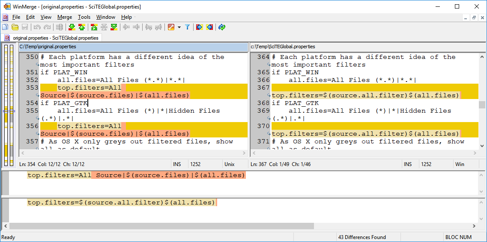

&nbsp;

### FRhed

**FRhed** è un potente editor esadecimale, adatto alla visualizzazione e alla
modifica di file binari e di testo. L’autore di questo software è Marcin Dudek,
e nonostante FRhed sia stato scritto nel tempo libero e per hobby, risulta
essere uno dei migliori editor esadecimali in circolazione. FRhed è gratuito,
ed è licenziato secondo la famosa **GNU GPL**, ciò ne garantisce l’assoluta
libertà di utilizzo e modifica.

**FRhed** viene installato con **RSciTE** ed è presente sia nel menu dei
programma di Windows, sia nel menu **Strumenti** interno a SciTE.

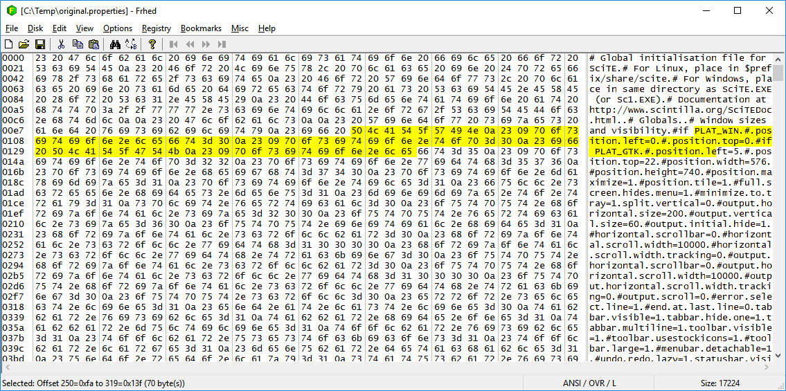

Per comprendere meglio la potenza di **FRhed**, ecco in sintesi, le sue funzionalità
salienti:

* **Applicazione nativa Windows** con supporto ai file con nomi lunghi e
dimensione file editabili limitata solo dalla quantità di memoria presente nel
sistema.
* **Dimensione programma ridotta** con caricamento istantaneo.
* **Taglia, copia e incolla** di valori binari.
* **Sintassi** per descrivere valori di tipo byte, word, longword, float and
double binary.
* Inserimento diretto di **valori esadecimali o di testo**.
* Possibilità di **confrontare** due file.
* **Trova/Sostituisci** di qualsiasi combinazione di valori testuali o esadecimali.
* Manipolazione diretta dei **bit**.
* Esportazione **hexdump**.
* **Impostazione** automatica/manuale dei byte visualizzati.
* Possibilità di **personalizzare** la dimensione dei font, il set dei caratteri,
i colori e lo sfondo.
* Supporto per **formati binari Intel e Motorola**.
* Comando per **Inviare a...**.
* Supporto per **segnalibri** personalizzabili.
* Supporto per il **caricamento parziale** dei file.
* **Drag & Drop**.
* Possibilità di **applicare modelli** a informazioni strutturate.
* **Accesso diretto** ai settori dei dischi.
* Supporto alla **Crittografia**.
* **Software Libero** con sorgenti disponibili e liberamente modificabili secondo la licenza GPL.

&nbsp;

### HTML Tidy, Formattare HTML e XML

Quando si editano file HTML o WML è sempre molto facile incorrere in errori,
inoltre la formattazione del codice scritto non sempre risulta ottimale e ben
allineata.

Proprio per risolvere questo tipo di problemi è nato HTML Tidy. Scritto da
**Dave Raggett**, HTML Tidy è un’utilità gratuita che permette di rilevare
un’ampia serie di errori, consentendo la formattazione automatica del codice
corretto.

Ogni errore individuato verrà segnalato e corretto, inoltre verranno rilevate
anche eventuali incongruenze o segnalati avvertimenti non ritenuti errori
veri e propri.

Per comprendere meglio il funzionamento di HTML Tidy, ecco alcuni esempi di
come il software interviene sul codice HTML.

**Rilevamento e correzione TAG mancanti**:

    <h1>Titolo
    <h2>Sottotitolo</h2>

viene corretto in :

    <h1>Titolo<h1>
    <h2>Sottotitolo</h2>

**Correzione ordinamento TAG**:

    
Questo è un paragrafo <b>grassetto <i>
    grassetto italico</b> grassetto?</i> normale?

viene corretto in:

    
Questo è un paragrafo <b>grassetto <i>
    grassetto italico</i> grassetto?</b> normale?

**Formattazione automatica codice HTML**:

    <td></td>
    <td></td>

viene trasformato in:

    <td>  </td>
    <td>  </td>

e molto altro ancora...

**HTML Tidy** non solo lavora sui file HTML ma, con alcune limitazioni, anche su
file XML, ASP, PHP, JSTE.

**HTML Tidy** è distribuito come programma a linea di comando, è comunque
possibile semplificare il suo utilizzo tramite l’uso di una delle interfacce
grafiche realizzate da programmatori indipendenti. Per maggiori dettagli si
consulti la sezione **Siti Utili**.

&nbsp;

### dnGREP

**dnGREP** è un software, multi piattaforma, studiato per semplificare la
ricerca e la sostituzione del testo.

Questo importante software, disponibile i **F12** alla voce **Trova/Sostituisci
su file multipli** semplifica le operazione di ricerca e sostituzione del testo
consentendo di operare in modo automatico su più file.

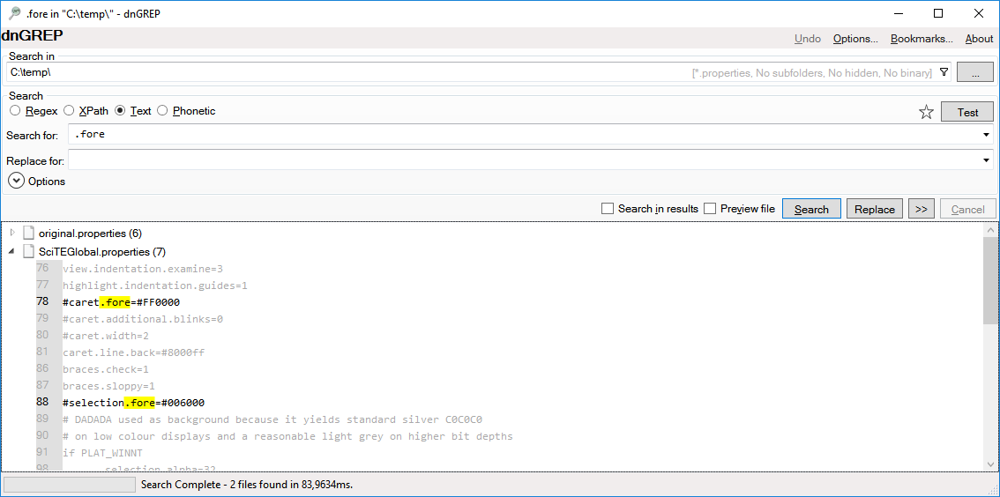

**dnGREP** risulta essere un programma estremamente potente e flessibile,
adatto sia al neofita, sia all’esperto programmatore, consentendo un utilizzo
esteso delle espressioni regolari.

Nell’immagine riportata sopra, si può osservare **dnGREP** durante
l’operazione di ricerca del testo **.fore** all’interno di tutti i
file .properties presenti in una cartella.

&nbsp;

### Personalizzare e Configurare RSciTE

**RSciTE** è estremamente flessibile, consentendo la modifica di una sterminata
serie di parametri, vediamo come configurare e personalizzare l’editor, per
renderlo più consono alle nostre abitudini.

In questa sezione sono raccolte diverse procedure per il settaggio dei
parametri più comuni di **RSciTE**, cosi da poter diventare, nel più breve tempo
possibile, operativi al **100%**.

#### Aiuto sensibile al contesto, per i file PHP, in RSciTE!

**F1**, il tasto di aiuto più utilizzato dai programmatori.

Durante l’editazione dei file scritti in **linguaggio PHP**, cosa c’è di
meglio che premere il tasto **F1** e visualizzare la guida della funzione che si
trova in corrispondenza del cursore?

Esattamente come gli editor più blasonati, anche **RSciTE** (a partire dalla V.2),
implementa **l’aiuto sensibile al contesto**, per utilizzarlo è sufficiente copiare
un file!

Prima di tutto procuriamoci il file ufficiale di aiuto per il linguaggio PHP.
Avendo l’accortezza di scaricare la versione in formato CHM :

[Clicca qui per scaricare il manuale ufficiale di PHP in formato CHM.](http://www.php.net/download-docs.php)

Attenzione : in Windows, dopo aver scaricato il file,
occorre cliccare su di esso con il tasto destro del mouse, quindi premere
"Proprietà". Fatto ciò occorre cliccare sul tasto "Annulla Blocco".
Questa operazione consente di utilizzarlo correttamente, in caso contrario
non sarà possibile consultarlo.

Una volta scaricato il nostro file (php_manual_en.chm):

* Posizionarsi nella cartella in cui è installato **RSciTE** (solitamente C:\Programmi\RScite).
* Copiare all’interno della cartella di **RSciTE** il file scaricato (php_manual_en.chm).

Compiute queste operazione, aprite un file PHP, con **RSciTE**, posizionate il
cursore in prossimità del nome di una funzione e premete il tasto **F1** :

[[Image:|top]] 

Ecco comparire l’aiuto relativo.

#### Colori di PHP come ‘Dreamweaver’

Ecco come configurare RSciTE in modo che la colorazione del linguaggio PHP
sia simile a quella presente nell’editor **Macromedia Dreamweaver MX**.

La colorazione per il linguaggio PHP, in **Macromedia Dreamweaver** prevede,
come valori predefiniti, i seguenti:

    BRACKET: #000099
    COMMENT: #FF9900
    CONSTANT: #552200
    FUNCTION KEYWORDS: #0000FF
    FUNCTIONS: #0000FF
    IDENTIFIER: #000000
    NUMBER: #FF0000
    OPERATOR: #0000FF
    RESERVED: #006600
    STRING: #CC0000
    TYPES: #009999
    VARIABLES: #0066FF
    TAGS: #000099

Per fare in modo che SciTE utilizzi le medesime impostazioni, occorrerà
modificare il file **html.properties** (presente nella cartella del programma)
oppure, più semplicemente, cliccare sul menu **Opzioni** e selezionare il
comando **Apri impostazioni del profilo utente**.

Una volta aperto il file, occorre aggiungere e/o modificare le linee che
iniziano come segue:

    style.hypertext.1 (Tags)
    style.hypertext.34 (Testo Predefinito)
    style.hypertext.35 (Testo Predefinito)
    style.hypertext.118 (Identificatori)
    style.hypertext.119 (Stringhe racchiuse tra doppi apici)
    style.hypertext.120 (Stringhe racchiuse tra apici singoli)
    style.hypertext.121 (Parole chiave)
    style.hypertext.122 (Numeri)
    style.hypertext.123 (Variabili)
    style.hypertext.124 (Commenti)
    style.hypertext.125 (Commenti a linea singola)
    style.hypertext.126 (Variabili PHP presenti nelle stringhe)
    style.hypertext.127 (Operatori)

Come si vede, ogni voce imposta una diversa opzione di colorazione,
semplicemente reimpostando questi valori e salvando il file si otterrà,
in SciTE, una sintassi stile Dreamweaver.

Per rendere più chiara la modifica da effettuare, ecco le linee di
configurazione complete, una volta applicati i corretti valori (presi da
Dreamweaver):

    style.hypertext.1=fore:#000099
    style.hypertext.34=fore:#FF0000
    style.hypertext.35=fore:#FF0000
    style.hypertext.118=fore:#000000
    style.hypertext.119=fore:#CC0000
    style.hypertext.120=fore:#CC0000
    style.hypertext.121=fore:#0000FF
    style.hypertext.122=fore:#FF0000
    style.hypertext.123=fore:#0066FF
    style.hypertext.124=fore:#FF9900
    style.hypertext.125=fore:#FF9900
    style.hypertext.126=fore:#0066FF
    style.hypertext.127=fore:#000099

#### Lavorare con fondo scuro

Una delle modalità che, personalmente, trovo più riposanti per la vista è
quella che prevede l’utilizzo di testo chiaro su fondo scuro.

Per ottenere questo effetto occorre modificare le varie configurazioni di
colori usate nei vari linguaggi, intervenendo sui settaggi presenti nei vari
file **.properties**.

Per evitare di modificare i file originali, presenti nella cartella di RSciTE,
si può cliccare sul menu **Opzioni** e selezionare il comando
**Apri impostazioni del profilo utente**.

Una volta aperto il file, inseriamo quanto segue:

    style.*.32=$(font.base),back:#000000,fore:#ffffff
    style.*.33=back:000000,$(font.base)
    style.*.37=fore:#939393
    caret.fore=#FFFFFF
    selection.alpha=75
    selection.back=#FFFFFF
    colour.keyword=fore:#649bff
    colour.operator=fore:#727272
    style.errorlist.32=$(font.small),back:#ffffff
    style.lua.32=$(font.code.base)
    style.lua.13=$(style.lua.5)
    style.lua.14=$(style.lua.5)
    style.lua.15=$(style.lua.5)
    style.lua.16=$(style.lua.5)
    style.lua.17=$(style.lua.5)
    style.lua.18=$(style.lua.5)
    style.lua.19=$(style.lua.5)
    style.lua.8=$(colour.string),$(font.code.comment.box)
    style.lua.1=$(colour.code.comment.box),$(font.code.comment.box),eolfilled
    style.lua.12=eolfilled
    style.hypertext.0=$(font.text)
    style.hypertext.1=fore:#0000ff
    colour.embedded.js=back:#000000
    style.hypertext.41=bold,$(fontcolour.js),eolfilled
    style.hypertext.46=$(fontcolour.js)
    style.hypertext.118=eolfilled
    style.hypertext.119=fore:#007F00
    style.hypertext.120=fore:#009F00
    style.hypertext.121=$(colour.keyword)
    style.hypertext.122=fore:#CC9900
    style.hypertext.123=bold
    style.hypertext.124=fore:#999999,$(font.comment)
    style.hypertext.125=fore:#666666,italics,$(font.comment)
    style.hypertext.126=fore:#00007F,italics
    style.hypertext.127=
    style.xml.0=$(font.text)
    style.xml.1=fore:#aaaa00
    style.batch.0=$(font.text)
    style.batch.7=$(font.text)
    style.inno.2=$(colour.keyword)
    style.inno.3=$(colour.keyword)
    print.colour.mode=1

Queste impostazioni permettono di utilizzare i normali file di testo e i file
scritti in **PHP/HTML/XML/Javascript/Lua/InnoSetup** con fondo nero e testo chiaro.

&nbsp;

### Siti Utili

**Siti relativi ai software inclusi in RSciTE**

Per poter approfondire la conoscenza delle applicazioni incluse in ’RSciTE’ 
ecco l’elenco dei collegamenti ai siti più utili.

- **Roberto Rossi**, autore di RSciTE 
    - [Roberto Rossi, Free Software e Open Source ](http://www.redchar.net/).
- **SciTE e Scintilla**
    - [Sintilla/SciTE Home Page Ufficiale ](http://www.scintilla.org/).
- **LUA**, linguaggio di programmazione
    - [Home Page Ufficiale LUA (Linguaggio di programmazione) ](http://www.lua.org/).
    - [Portale della comunità LUA](http://lua-users.org/).
    - [Script LUA in SciTE ](http://lua-users.org/wiki/SciteScripts).
- Markdown, linguaggio per la scrittura
    - [Pagina di MultiMarkdown](http://fletcherpenney.net/multimarkdown/).
- **dnGREP**, trova e sostituisci
    - [Pagina ufficiale del progetto](https://dngrep.github.io/).
- **WinMerge**, software di confronto
    - [WinMerge Home Page ](http://winmerge.sourceforge.net/).
- **Frhed**, editor esadecimale
    - [Home Page Ufficiale di Frhed](http://frhed.sourceforge.net/).
- **HTML Tidy**, elaboratore HTML
    - [Home Page Ufficiale di HTML Tidy](http://tidy.sourceforge.net/).
    - [Sito di Dave Raggett su HTML Tidy](http://www.w3.org/People/Raggett/tidy/).
    - [Tidy UI. Interfaccia grafica per Windows di HTML Tidy](http://users.rcn.com/creitzel/tidy.html#tidyui).
    - [TidyGUI. Interfaccia grafica alternativa, per HTML Tidy](http://perso.wanadoo.fr/ablavier/TidyGUI/).
    - [HTML validator che sfrutta HTML Tidy per il controllo delle pagine](http://www.thedumbterminal.co.uk/services/tidy.shtml).
- **Cloc**, Count Lines of Code
    - [Pagina Ufficiale di Cloc](http://cloc.sourceforge.net/).

&nbsp;

### Nota di Copyright

Questo documento, **RSciTE. Guida alle Caratteristiche**, è distribuito 
secondo la seguente licenza.

Copyright (c) 2005-2022 Roberto Rossi.

Permission is granted to copy, distribute and/or modify this document under
the terms of the GNU Free Documentation License, Version 1.2 or any later
version published by the Free Software Foundation, with no Invariant Sections,
with the Front-Cover Texts being **RSciTE - Guida alle Caratteristiche**,
and with no Back-Cover Texts.
